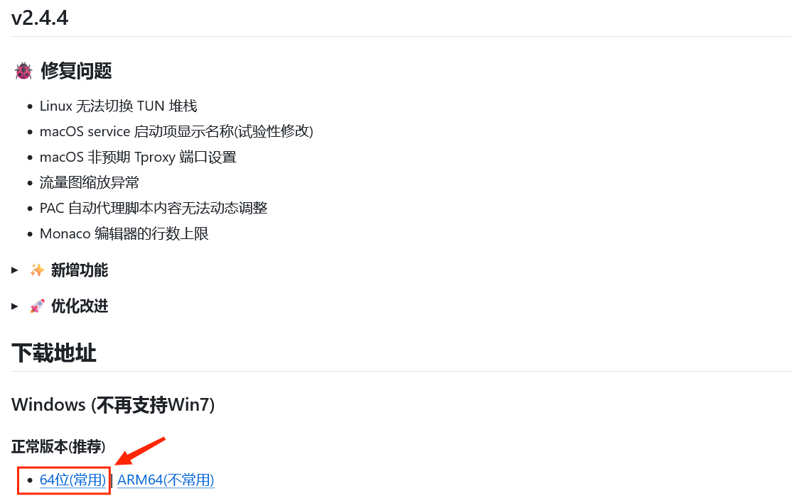
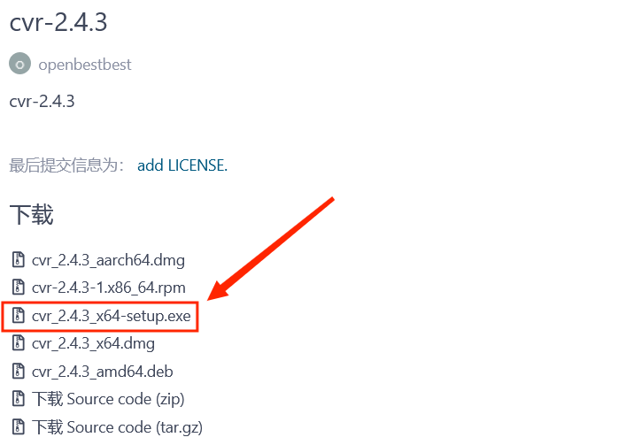
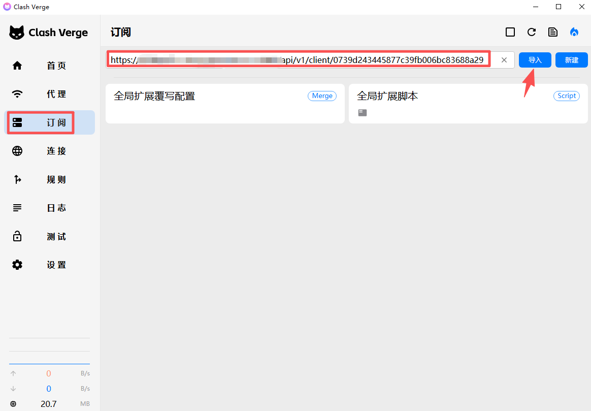
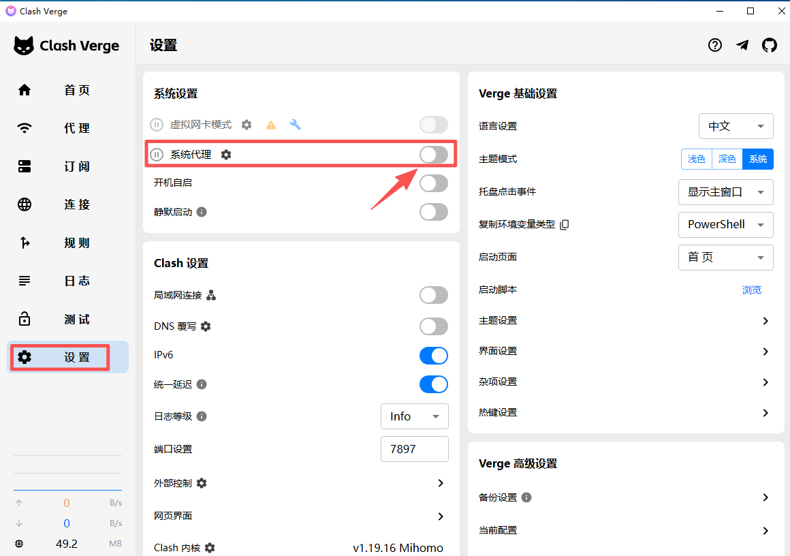

### 前言
在数字世界的浩瀚河流中，总有一些岸边被雾气笼罩，使人无法轻易靠近。但阻隔并不代表终点，只是提醒我们——通向远方的路，并不只一条。借助代理的力量，我们得以在暗处为自己点亮一盏灯，穿过那些看不见的潮汐，抵达原本触不可及的地方。

为了让你也能踏上这条通往彼端的小径，本文将以温和而清晰的步伐，带你掌握如何利用工具完成代理访问，从安装到配置，一点点拨开迷雾，让道路显现。
### 节点
通过使用代理服务器，以此来达到访问外部网络的目的。[SSONE](https://hello-ssone.com/)是一个比较不错的代理服务，节点多，网络传输速度也很快，很稳定，而且它的最低订阅也很便宜。当你订阅之后，只需要将其首页的订阅地址导入到代理软件中，就能够使用此项服务。

比较推荐的客户端是 Clash Verge

- [Github官方下载地址](https://github.com/clash-verge-rev/clash-verge-rev/releases)
- [Gitee下载地址](https://gitee.com/openbestbest/cvr/releases)

需要说明的是：**选择Github下载**（下载速度较慢，但是肯定是最新版本）

	选择Gitee下载 （下载速度很快，版本可能更新不及时）

### 客户端
	将订阅的地址复制，然后打开Clash Verge

	选择订阅选项卡，将复制的地址粘贴到订阅栏中，随后点击导入

	在设置中将系统代理打开，就可以愉快的访问了！
