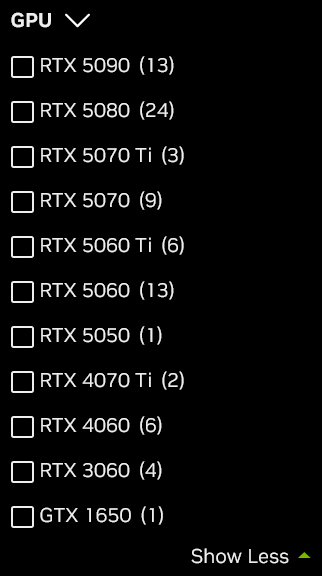

### 前言
有许多人想要配置一台性价比不错的台式机，搞组装机，可能会觉得比较划算，因此萌生了写一篇这样指南的想法，也是想通过借这个机会学习一下，怎么组装出一台台式机。
我首先需要知道一台电脑都需要什么部件。**中央处理器CPU**、**主板**、**显卡GPU**、**内存**、**硬盘**、**散热**、**电源**、**机箱**，接下来的内容会从这八个部分一一介绍。
### 中央处理器CPU
现在市面上的CPU都是**Inter**或**AMD**的，恩，我们先说英特尔的。

英特尔主要有两个系列，一个是酷睿，面向个人用户，另一个是志强系列，在服务器上面用的比较多。个人的话，基本上就是选择酷睿系列的。接着来看一下酷睿系列的命名规则：

I3-13100F    F-没有核显

I5- 9600K     K-可以超频

I7-13700KF

I9-13900KS    12代过后，用S表示当代最强旗舰

I9-  9900XE    X/E-当代最强旗舰

- I3、I5、I7、I9表示CPU的级别，数字越大，越厉害。
- 后面的一到两位，比如I3-13100F和I5-9600K，分别表示，I3的第13代和I5的第9代。代数越大，发布的时间距现在的时间也就越近，说明是刚出不久的，性能也就越好。
- 后面的三位数字则表示性能水平，在代数一定的情况下，数字越大，性能越强。
- 同样代数的CPU，CPU的级别越高，性能越强。

接着来简单说一下**AMD**，它也分为两个系列，一个是锐龙，面向个人用户的，另一个是霄龙，也是用在服务器上的。也来说一下命名规则：

R3-3100

R5-5600G    G-表示有核显

R7-7700X

R9-7950X    X-可以自动超频，不带X,只能手动超频

- R3、R5、R7、R9，和Intel一样，也是表示CPU的级别，数字越大，越厉害。
- 后面数字的第一位数字表示代数
- 其余三位数字表示性能水平

Intel的游戏性能要略高于AMD，（CPU的预算是显卡价格的一半）
### 显卡GPU
现在市面上的显卡中的核心芯片大多数是英伟达（NVIDIA）和AMD公司生产的。

先来看一下NVIDIA显卡的命名规则：

GTX980

GTX1650

RTX3060

RTX4070

RTX5060Ti

- 现在NVIDIA官网在售的只有GTX1650和RTX系列的。RTX支持光线追踪，它可以让游戏画面更加真实，而GTX并不支持光线追踪。
- 四位数字的中的前两位，表示架构代数
- 后两位数字表示性能水平，50-入门级，60-中端，70-中高端，80-高端，90-顶级旗舰
- 最后的后缀，无后缀-标准版，Ti-加强版，SUPER-介于标准版与Ti之间，OC-工厂超频版，最常见的就是标准版和加强版Ti，SUPPER和OC基本不常见。
截止于编辑这篇文章的日期，NVIDIA官网在售的显卡只有以下几种：

再来看看AMD显卡的命名规则，它其实和英伟达显卡命名规则类似。
例如：

AMD Radeo RX 6900 XT

- AMD Radeo-AMD显卡品牌，RX-高性能独立显卡，无RX-核显或低功耗显卡，多见于笔记本。
- 中间的数字表示系列代数，一般有6000系列，7000系列，9000系列，与之对应的，它们的架构也不一样。
- 第二位数字表示性能级别，4-入门级，5-主流，6-中端，7-中高端，8-高端，9-旗舰。
- 有时后两位数字是50，表示该系列的小幅升级版本。例如：RX 6650
- 后缀XT表示强化版
### 主板
如果说CPU是电脑的大脑，那么主板就是电脑的骨骼，用来承载和连接各种电脑配件。

支持Intel酷睿CPU的主板一共有三个系列的芯片组，分别为：

	H系列    H610    低端
	B系列    B760    中端
	Z系列    Z790    高端
支持AMD锐龙CPU的主板也有三个系列的芯片组，分别为：

	A系列    A620    低端
	B系列    B650    中端
	X系列    X670    高端
主板尺寸规格：
	ATX        标准版    大       扩展多
	M-ATX   小板        中等   性价比高
	ITX        迷你版    小       便携
### 内存
内存相对于上面的部件制作来说相对容易，国内国外都有厂家，但国内相比国外起步较晚。

市面上主流的内存分别是：DDR（Double Data Rate 双倍数据速率）
	DDR5 6000
	DDR4 3200
	DDR3 1600
- DDR后面的数字表示代数，数字越大，技术越新，性能越好，当然，价格也更高。
- 不同代数的DDR内存物理上不兼容，需要确认的是主板支持的是DDR4还是DDR5，或者其它代数。
- DDR5 6000  后面的数字6000表示数据传输速率。即6000 MT/s（3000Mhz）
- 内存的颗粒也很重要（英伟达，三星自己生产颗粒）
- 高速度（6000）也要搭配合理的时序（CL30,CL32）。时序表示延迟，数字越小，延迟越低。
### 硬盘
硬盘分为固态硬盘和机械硬盘，不用想，直接选用固态硬盘，体积小。固态又分为M.2接口的和SATA接口的，M.2速度快，但是不支持老电脑，而SATA接口则支持所有电脑。M.2接口的固态又又分为Pcie 3.0 和 Pcie 4.0，后者的读写速度可达到5000M/s-7500M/s，是前者的两倍之多。硬盘也比较容易造假，如果买的话，要去老牌厂商买，比如致态。
### 电源
有一个80 Plus认证，可以看一看。电源虽然看起来不起眼，比起上面的部件，不是太高端，但它却是最核心的，是为整台电脑提供能源的装置，所以，别的可以省，电源一定不要省，一定要弄好的。
### CPU散热
只需要根据选择的CPU型号，在网上买相关的散热都是可以用的。一般风冷就可以，水冷的话，贵。
### 机箱
主要就是尺寸问题，要将你的阿所有部件都装进去，因此，首先需要确定的主板的尺寸，根据主板的尺寸选择一个合适的机箱。机箱也和主板一样，有ATX、M-ATX、ITX。
