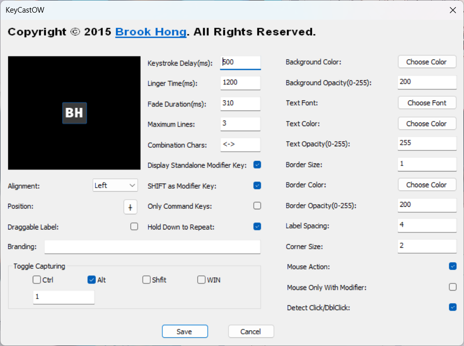

## 装机指南

:::tip
由于最初对电脑不甚了解，磁盘分区时不够不合理，导致系统盘可用空间不足，甚至可能因空间过小引发系统崩溃等情况。虽然尝试过各种清理方法，但都收效甚微。其中一个解决方法是重装系统，将整个磁盘空间重新划给系统盘，但这样会丢失所有已安装软件，重新配置软件环境又很繁琐。写下这篇文章，是为了记录电脑上已有的软件。当最坏的情况发生，二周目会顺利一些。因此下述记录可能没有那么全面，但希望能作为一个参考。
:::
### 新电脑

当你有一台新的电脑时，如果你选择的系统是 Window，那么你一定听过，C盘是系统盘，下载东西不要下到C盘，而新电脑一般都只有一个C盘，比如HP。也有一些厂家，他会事先给你分好盘，一个C盘，一个D盘。

如果你想要将你的磁盘分好几个盘符，一个放游戏，一个放电影，还有一个放书籍......

其实分不分盘，按照我的使用经验来看。首先要看你的磁盘是多大的，如果是512G的，那么其实一个C盘就挺好的，不然分那么多，然后每个盘都下一点东西，就会造成明明我还有200G的空间，但是都被分散到了各个盘里，能使用的最大空间其实并不多。

如果你是1TB的或者更大，那就可以试试**磁盘分盘**了。具体怎么操作，且听下回娓娓道来。

### 火绒安全软件

下载[**火绒安全软件**](https://www.huorong.cn/)，打开主界面，点击**安全工具**，下载**弹窗拦截**，这些都是**开机自启**，请不要关闭。这可以有效的阻止弹窗，减少一些不必要的烦恼。

### geek

如果你想要**卸载一个软件**，那么你通常会去到**设置**->**应用**->**安装的应用**，找到你想要卸载的软件，然后点击卸载，就会调用软件自带的卸载程序，开始卸载。不过这有可能会有卸载残留。其实使用[**Geek**](https://geekuninstaller.com/)进行卸载，它也是直接调用被卸软件的卸载程序，只不过多加了一步，会帮助你清理注册表的残留。

市面上软件很多，不是所有厂商它的卸载程序都能将他自己的东西清理干净，最常见的就是你安装了一个软件，然后后续需要用到高版本的，就需要把现在低版本的卸载，再安装高版本的。但会出现一种情况，就是卸载不干净（注册表有残留），导致你安装高版本的时候，安装不成功，这时就会有一部分人选择重装系统解决这个问题。然而，当你使用这个[**Geek**](https://geekuninstaller.com/)这个软件，就不必重装系统，它可以帮助你**清理注册表残留**。

### 7-ZIP

这是一款解压缩软件，我们平时最常见的压缩包格式主要有这些：

- RAR

- ZIP

- 7z

如果你在网上下载文件，很容易就会遇到这些格式。使用[**7-ZIP**](https://7-zip.org/) 可以很方便将这些压缩包解压。

### Cheat Engine

[**Cheat Engine**](https://www.cheatengine.org/)是一个修改器，可以帮助你修改数据，包括但不限于一些单机游戏的数据、还有百度网盘的限速问题等等。功能很强大的工具。官网下载的没有汉化，但网上有许多汉化教程。吾爱破解论坛上有分享的[**7.4汉化版本**](https://www.52pojie.cn/thread-1573180-1-1.html)的。

### AutoCAD

正版的[**AutoCAD**](https://www.autodesk.com.cn/products/autocad/overview)费用很贵，每年的费用在1w以上，而且还不是买断制。因此这个软件在教学过程中使用较多，但也都大多是是一些[**学习版**](http://www.zhanshaoyi.com/)。而企业，面对如此高的成本，一般会选择市面上可替代的或免费的一些版本。

### Typora

Typora 是一个所见即所得的 Markdown 跨平台写作工具。[**官网**](https://typoraio.cn/)许多版本目前已收费。但仍有一些早期的官方版本是免费的。但在官网上没有找到。但可以[**参见**](https://zahui.fan/posts/64b52e0d/)这篇博客。论坛上也有许多针对其进行破解的。可以[**参阅**](https://www.52pojie.cn/thread-1710146-1-1.html)相关文章。

### utools

[**uTools**](https://u.tools/)更像是一个下载插件的插件商店，主要的用途是快速访问文件和使用一些翻译的小功能。但是当时我安装时，是默认安装在C盘的，它的一些文件也在C盘，因此可以使用[**数据迁移**](https://yuanliao.info/d/1166-utools)将数据放在其他文件夹里。

### VMware

这个软件我用它来运行 Linux 发行版之一的 Ubuntu-20.04.6。我是用它来虚拟一个 Linux 系统，这是我对它局限的认知，期望我以后可以有更好的理解。关于这个软件的应用，可以<a href="虚拟机.md">查看</a>另一篇文章。关于如何安装，可以看[**这个**](https://www.cnblogs.com/hellogmy/p/17253041.html)。

### Dev-Cpp

这是一个适合C语言初学者使用的编辑器，它的体积并不大，界面也比较简洁。但是它已不再更新，且没有良好的代码提示功能，但作为刚入门来使用，还是比较合适的。这是它的[**下载**](https://sourceforge.net/projects/orwelldevcpp/)网址。

### Python

建议到Python[**官网**](https://www.python.org/)进行下载，选择适合自己电脑的安装包。安装教程可以[**查看**](https://zhuanlan.zhihu.com/p/344887837)这个，这个教程是基于 Window 的。

### Anaconda3

该软件可以创建一个支持python程序运行的虚拟环境，并打包发布，可以打包成exe文件。

### Jetbrains-Pycharm

这是一个编辑器。**[官网](https://www.jetbrains.com/pycharm/download/?section=windows)**提供了专业版和社区版的下载链接，建议下载社区版，因为是免费的。但是现在社区版的位置并不是很明显，需要点击**其它版本**才可以找到。

安装教程以及新建自己的第一个项目，可以看这篇[**文字教程**](https://www.jianshu.com/p/eb606812765d)，如果图片加载失败，可以换个浏览器试试。还有这个[**视频**](https://www.bilibili.com/video/BV1CE411Z7rH/?spm_id_from=333.999.0.0&vd_source=2a56056c25b9c9a1d5d14061494e574a)讲解如何新建一个项目。

### keil5 C51

嵌入式开发用的比较多，[**安装包及安装教程**](https://www.bilibili.com/video/BV1Mb411e7re/?p=2&spm_id_from=pageDriver&vd_source=2a56056c25b9c9a1d5d14061494e574a)。

### Proteus8

 嵌入式开发避免不了与硬件打交道，但是有些时候，你可能没有对应的硬件，就可以使用这个软件进行仿真测试。[**安装教程**](https://www.bilibili.com/video/BV1iG411S7tw/?spm_id_from=333.337.search-card.all.click&vd_source=2a56056c25b9c9a1d5d14061494e574a)

### Firefox

**[国际版下载地址](https://www.mozilla.org/en-US/firefox/all/#product-desktop-release)**

### Google Chrome

当有适当的网络环境，可去官网下载

### Microsoft VS Code

下载：可自行去官网下载

安装：按提示安装即可

配置环境：...根据写不同的语言，方法也不同。

### MikuMikuDance 926 CHS

当时最初想的是需要一个特定的模型，根据特定的动作，渲染出一段动画，然后就了解到这一个软件，因时间久远，已经忘记当时是怎么下载的了。本机上仍保留当时的压缩包。但后来我又去网上搜索了一下，发现了别人发的。[**地址**](https://github.com/ayaka-mmd/MikuMikuDance-926-CHS)

### mingw64

在 Window 环境下,这是在命令行下编译 C 程序需要的。未完待续...

### SublimeText

这是一个文本编辑器
下载：[**官网**](https://www.sublimetext.com/)

安装的插件：

- AutoFileName: 这是可以自动索引相关文件
- BracketHighlighter: 高亮显示匹配的括号、引号和标签。
- Package Control: 这是管理插件的
- PackageResourceViewer: 这个可以让用户修改默认的主题文件
- Terminus: 这是在底部增加一个系统的内置终端
- 主题：ayu

### Git

[**安装教程**](https://blog.csdn.net/mukes/article/details/115693833) && [**在Window中使用Git**](https://nulab.com/zh-cn/learn/software-development/git-tutorial/how-to-use-git/git-on-windows/)

### IDEA 2023.2.5

建议下载旗舰版。[**安装教程**](https://www.quanxiaoha.com/idea-pojie/idea-pojie-202325.html) && [**使用教程**](https://www.quanxiaoha.com/idea/idea-tutorial.html)

### Draw.io

这个软件是绘制框图不错的选择。它有[**在线版**](https://app.diagrams.net/)和[**离线版**](https://www.drawio.com/)两种。在线版可以直接在网页上打开直接绘制，比较方便。而离线版就是下载软件，可以在没有网络的情况下绘制。[**快速入门**](https://www.bilibili.com/video/BV1Tu411U7v7/?spm_id_from=333.788.comment.all.click&vd_source=74986cdad424be33a5c5bfadf1fd6895)

### Pot

这是一个跨平台划词翻译和OCR识别软件
对于外文能力不太好的同学，当在网络上查看资料的时候，会遇到一些不认识的外文词汇，遇到最多的可能就是英文。平常我们是怎么做的呢？我们会首先会将不认识的单词用鼠标选中，复制，接着打开百度翻译或者其它在线翻译网站，然后粘贴，我们得到了这个单词的中文意思。但是，当我们使用这款软件后，做好快捷键设置后，只需要使用鼠标将不认识单词选中，然后按下快捷键，就会弹出来一个小界面，立马就把单词的意思给翻译出来了。

上述是我常用的功能，它也还有一些其它的功能，感兴趣的话可以[**点击下载**](https://pot-app.com/)，官网也有它的使用指南。

### Key Cast

这是一个屏幕显示输入信息工具。就是当你按下按键盘上的某个键或点击鼠标，他会在屏幕上显示你按下按键的名称。用户可能担心它会记录你的操作，隐私信息被泄露。但是软件是开源的，可以直接去[**GitHub**](https://github.com/brookhong/KeyCastOW)下载，然后使用[**VS2022自已编译**](https://www.bilibili.com/video/BV1Tb411T7hg/?spm_id_from=333.337.search-card.all.click&vd_source=2a56056c25b9c9a1d5d14061494e574a)运行。

软件设置如下：

由于这个软件没有开机自启这个设置选项，开机自启可以按如下设置：

按下 Win+R 打开运行窗口，输入 shell:startup，然后将exe文件的快捷方式放入打开的文件夹中。路径为： C:\Users\用户名\AppData\Roaming\Microsoft\Windows\Start Menu\Programs\Startup 

### ClickShow

这是一个鼠标增效工具，可实现鼠标高亮，鼠标点击效果。[**介绍视频**](https://www.bilibili.com/video/BV15Y4y147t5/?spm_id_from=333.337.search-card.all.click&vd_source=2a56056c25b9c9a1d5d14061494e574a) && [**下载地址**](https://github.com/cuiliang/ClickShow/releases)

### TranslucentTB

这个软件的功能是：让任务栏变透明，[**下载地址**](https://github.com/TranslucentTB/TranslucentTB">下载地址)

### HEU KMS Activator v63.0.0

当Window未激活时，可以使用这个软件激活。[**下载地址**](https://github.com/zbezj/HEU_KMS_Activator/releases) && [**使用教程**](https://www.aichunjing.cn/835.html)

## 参考

<ol>
	<li><a href="https://www.me83.com//" target="_blank">XINCHEN</a></li>
</ol>
