## 基本概念

某些精确度程度较高的零件，不仅需要保证其尺寸公差，还要保证其几何公差。零件的几何特性是：零件的实际要素对其几何理想要素的偏离情况。限制零件对几何误差的最大变动量，称为几何公差、允许变动量的值，称为公差值。
## 重要术语

**基准要素**：标注为基准的要素必然存在加工误差，因此，在必要时应对其规定适当的形状公差。

## 分类、几何特称和符号

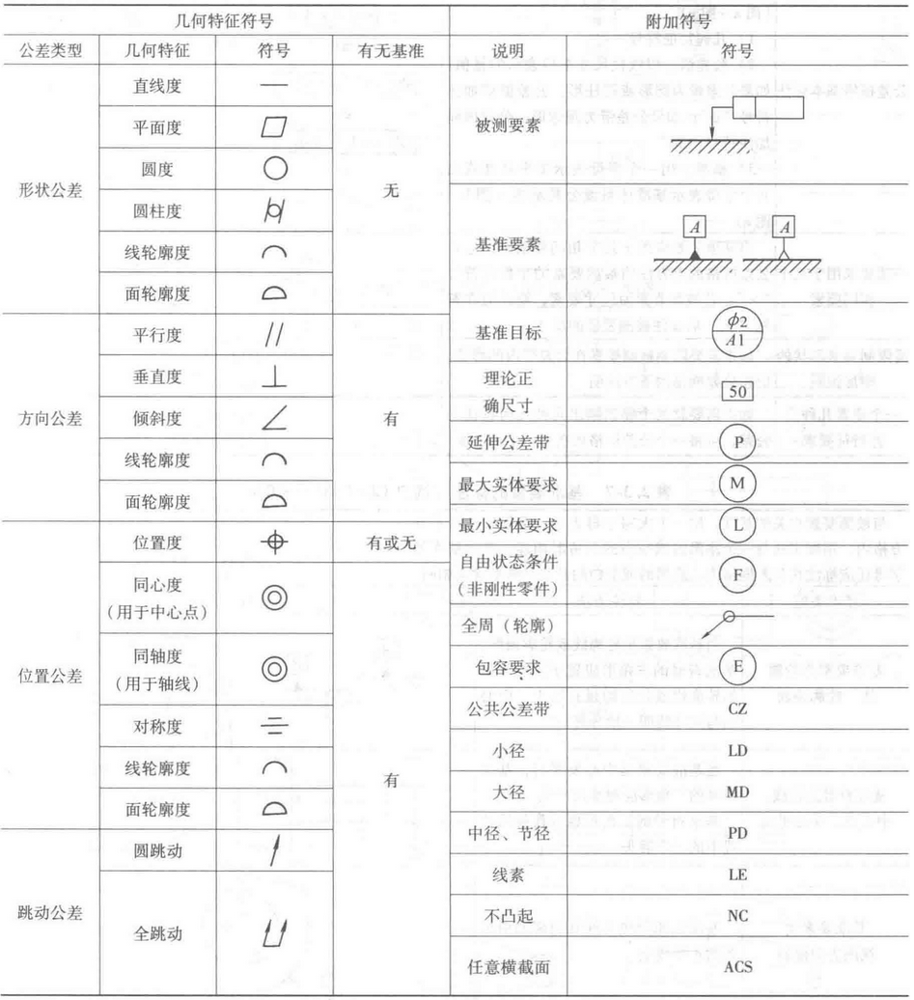

### 直线度
直线度（形状公差），通常所说的**直线平直的程度**。直线度公差是实际直线对理想直线所允许的最大变动量。

例1：在给定平面内，公差带应限定在间距为0.1mm的两平行线之间的区域。
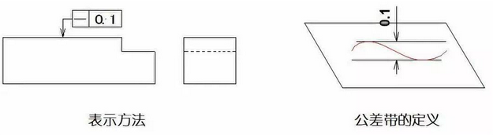
例2：在公差值前面加直径符号Φ，则公差带必须在直径为0.08mm的圆柱面内的区域。
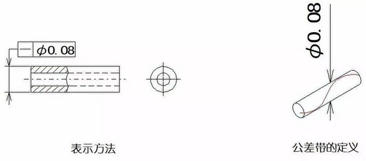
### 平面度
平面度（形状公差），既通常所说的**平面的平整程度**。平面度公差是实际平面对理想平面所允许的最大变动量。

例：公差带是位于间距为0.08mm的两个平行平面之间的区域。
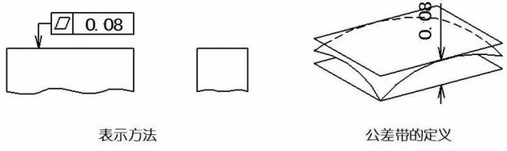
### 圆度
圆度（形状公差），即通常所说的**圆的圆整程度**。圆度公差是在同一截面上，实际圆对理想圆所允许的最大变动量。

例：公差带必须在同一正截面上，半径差为公差值0.0.3mm的两个同心圆所限定的区域。
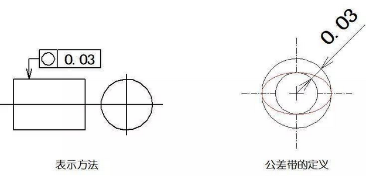

### 圆柱度
圆柱度（形状公差）是表示零件上圆柱面外形轮廓上的各点，对其轴线保持等距状况。圆柱度公差是实际圆柱面对理想圆柱面所允许的最大变动量。

例：公差带为半径差等于公差值0.1mm的两同轴圆柱面所限定的区域。
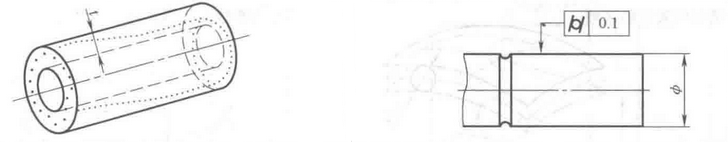
### 线轮廓度
线轮廓度是表示在零件的给定平面上，任意形状的曲线，保持其理想形状的状况。线轮廓度公差是指非圆曲线的实际轮廓线的允许变动量。

例：公差带是由包络一系列直径为公差值0.04mm的圆的两包络线之间的区域。（诸圆的圆心位于具有理论正确几何形状的线上）。
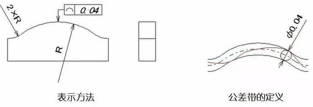
### 面轮廓度
面轮廓度是表示零件上的任意形状的曲面，保持其理想形状的状况。面轮廓度公差是指非圆曲面的实际轮廓面，对理想轮廓面的允许变动量。

例：公差带为直径等于公差值0.02mm、球心位于被测要素理论正确形状上的一系列圆球的两包络面所限定的区域。
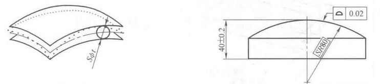
### 平行度
平行度（方向公差），即通常所说的**保持平行的程度**，表示零件被测实际要素相对于基准保持等距离的状况。平行度公差是被测要素的实际方向，与基准相平行的理性方向之间所允许的最大变动量。

例1：公差带为间距等于公差值0.1mm、平行于两基准的两平行平面所限定的区域。
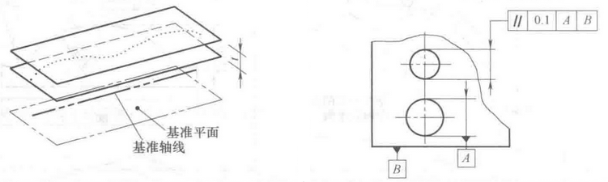
例2：公差带为间距等于公差值0.1mm、平行于基准轴线A且垂直于基准平面B的两平行平面所限定的区域。
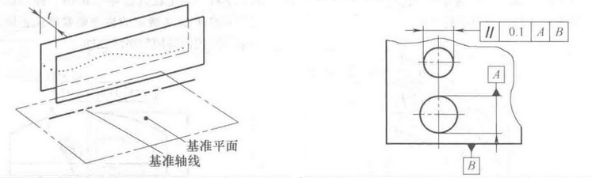
例3：若公差值前面加了直径符号“Φ”，公差带为平行于基准轴线，直径等于公差值Φ0.03mm的圆柱面所限定的区域。
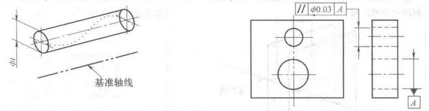
例4：公差带为间距等于公差值0.02mm的两平行直线所限定的区域。该两平行直线平行于基准平面A、且处于平行于基准平面B的平面内。
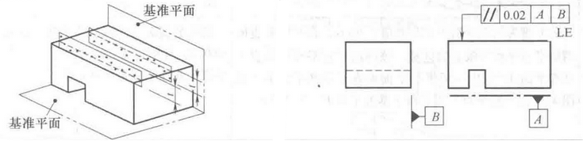
### 垂直度
垂直度（方向公差），即通常所说的**两要素之间保持正交的程度**，表示零件上被测要素相对于基准要素，保持正确的90°夹角的状况。垂直度公差是被测要素的实际方向，对于基准相垂直的理想方向之间所允许的最大变动量。

例1：公差带为间距等于公差值0.08mm、且垂直于基准轴线的两平行平面所限定的区域。
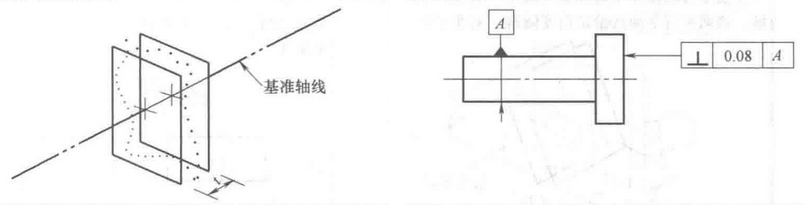
例2：若公差值前面加了直径符号“Φ”，公差带为直径等于公差值Φ0.01mm、轴线垂直于基准平面A的圆柱面所限定的区域。
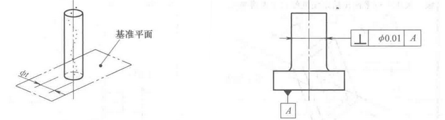
例3：公差带为间距等于公差值0.1mm的两平行平面所限定的区域。该两平行平面垂直于基准平面A，且平行于基准平面B。
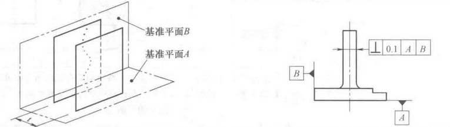
### 倾斜度
倾斜度（方向公差）是表示零件上**两要素相对方向保持任意给定角度的正确状况**。倾斜度公差是被测要素的实际方向，对于基准成任意给定角度的理想方向之间所允许的最大变动量。

例1：公差带为间距等于公差值0.08mm的两平行平面所限定的区域。该两平行平面按给定角度倾斜于基准平面A（中心线应限定在间距等于0.08mm的两平行平面之间。该平行平面按理论正确角度60°倾斜于基准平面A）
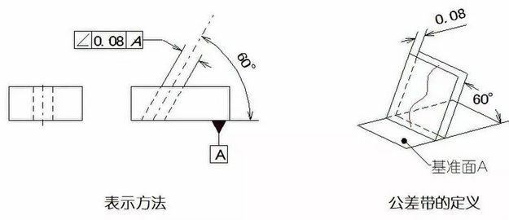
例2：若公差值前面加了直径符号“Φ”，公差带为直径等于公差值Φ0.1mm的圆柱面所限定的区域。该圆柱面公差带的轴线按给定角度倾斜于基准平面A且平行于基准平面B（中心线应限定在直径Φ0.1mm的圆柱面内。该圆柱面的中心线按理论正确角度60°倾斜于基准平面A且平行于基准平面B）
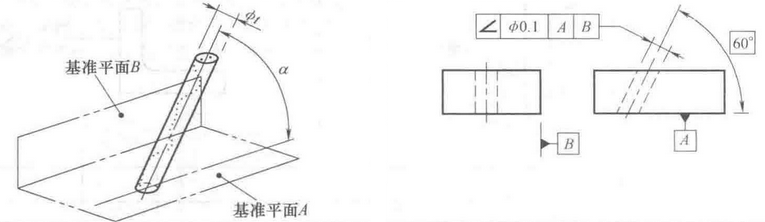
### 位置度
位置度时表示零件上的点、线、面等要素，相对其理想位置的准确状况。位置度公差是被测要素的实际位置相对于理想位置所允许的最大变动量。

例：公差值前面加了“SΦ”，公差带为直径等于公差值SΦ0.3mm的圆球面所限定的区域。该圆球面中心的理论正确位置由基准A、B、C和理论正确尺寸确定。
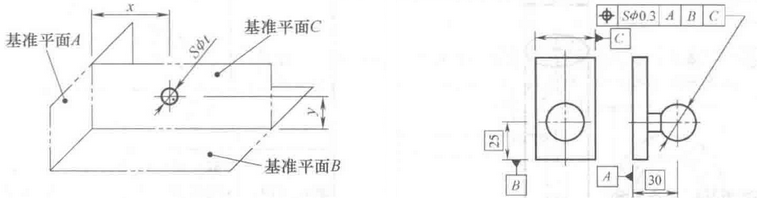
### 同心度和同轴度
同轴度，即通常所说的**共轴程度**，表示零件上被测轴线相对于基准轴线，保持在同一直线上的状况。同轴度公差实际被测实际轴线相对于基准轴线所允许的变动量。

例：公差值前标注直径符号Φ，公差带是直径等于公差值Φ0.08mm的圆柱面所限定的区域。该圆柱面的轴线于基准轴线重合。
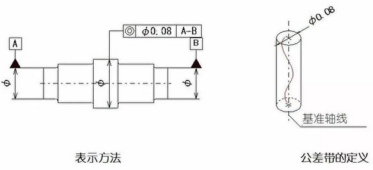
### 对称度
**中心平面的对称度公差**

对称度是表示零件上两对称中心要素保持在同一中心平面内的状态。对称度公差是实际要素的对称中心面（或中心线、轴线）对理想对称平面所允许的变动量。

例：公差带是距离为0.08mm、且相对于基准中心平面或中心线对称配置的两平行平面之间或直线之间的区域。
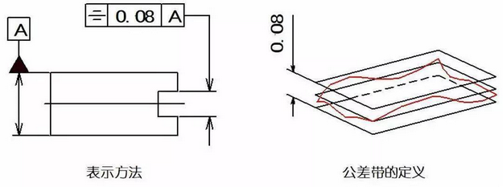
### 圆跳动
圆跳动是表示零件上的回转表面在限定的测量面内，相对于基准轴线保持固定位置的状况。圆跳动公差是被测实际要素绕基准轴线，无轴向移动地旋转一整圈时，在限定的测量范围内所允许的最大变动量。

**径向圆跳动公差**

例：公差带是垂直于任一测量平面内，半径差0.1mm，且圆心在同一基准轴线上的两同心圆之间的区域。
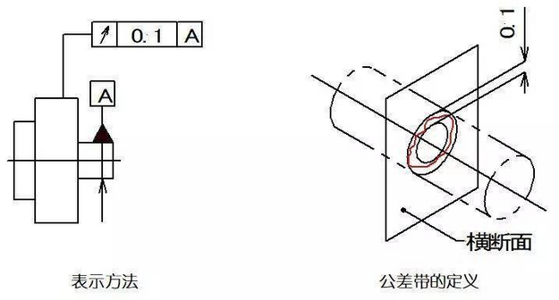
**轴向圆跳动公差**

例：公差带为与基准轴线同轴的任一半径的圆柱截面上，间距等于公差值0.1mm的两圆所限定的圆柱面内。（与基准轴线D同轴的任一圆柱形截面上，圆应限定在轴向距离等于0.1mm的两个等圆之间）
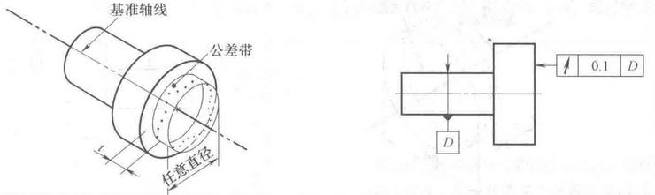
### 全跳动
全跳动是指零件绕基准轴线作连续旋转时，沿整个被测表面上的跳动量。全跳动公差是被测实际要素绕基准轴线连续的旋转，同时指示器沿其理想轮廓相对移动时所允许的最大跳动量。

**径向全跳动公差**

例：公差带是距离为半径差0.1mm，且与基准同轴的两圆柱面之间的区域。

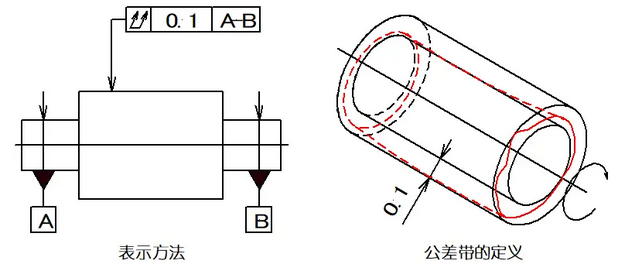
**轴向全跳动公差**

例：公差带是距离半径差0.1mm，且与基准轴线垂直的两平行平面之间的区域。
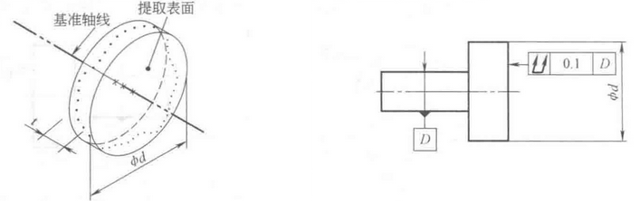

## 参考
<ol>
	<li><a href="https://wiki.cax.do/%E5%87%A0%E4%BD%95%E5%85%AC%E5%B7%AE/" target="_blank">CAX wiki 几何公差</a></li>
	<li><a href="http://jsmes.org/Home/Preview?id=2228&channelId=11&orderbyid=1" target="_blank">江苏省机械工程学会 几何公差</a></li>
</ol>

