## 基本概念
### 尺寸公差
零件在制造过程中，由于机床精度、刀具磨损、测量误差等因素的影响，完工后的尺寸与公称尺寸间总会存在一定的误差，所以在设计中对零件的尺寸应分别规定合理的尺寸精度。**精度高，误差小，但加工难，成本高；若精度低，则相反**。所以应在满足设计要求的前提下，考虑加工的可能性和经济性，尽量选用较低的精度，按选用的精度等级，必须将零件的尺寸控制在允许变动的范围内。**为保证零件的互换性，也必须将零件的尺寸控制在允许变动的范围内。这些允许的尺寸变动量称为尺寸公差**。
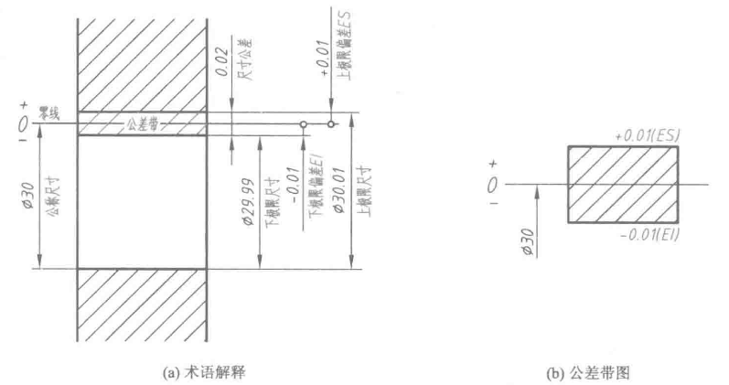
**公称尺寸**：由图样规范确定的理想形状要素的尺寸。

**极限尺寸**：允许尺寸变动的两个极限值。

**上极限尺寸**：允许的最大尺寸。

**下极限尺寸**：允许的最小尺寸。

**极限偏差**：极限尺寸减去公称尺寸所得的代数差。孔的上、下极限偏差代号分别用大写字母***ES***和***EI***表示。轴的上、下极限偏差代号分别用小写字母***es***和***ei***表示。

**上极限偏差**：上极限尺寸 - 公称尺寸

**下极限偏差**：下极限尺寸 - 公称尺寸

**尺寸公差**：上极限偏差 - 下极限偏差

**公差带、公差带图和零线**：公差带是表示公差大小和相对零线位置的一个区域。上、下极限偏差围成的矩形框简图，称为公差带图。在公差带图中，零线是表示公称尺寸的一条直线，以其为基准确定偏差和公差；零线通常沿水平方向绘制，正偏差位于其上，负偏差位于其下。
### 配合
**公称尺寸相同的、相互结合的孔和轴公差带之间的关系，称为配合。**
根据实际需要，配合分为三类：**间隙配合**、**过盈配合**、**过渡配合**。

**间隙配合**：（包括最小间隙等于0）孔的公差带在轴的公差带上方。孔的最小尺寸（下极限尺寸）都要比轴的最大尺寸（上极限尺寸）要大。在这种情况下，轴可以在孔中做相对运动。

**过盈配合**：（包括最小过盈等于0）轴的公差带在孔的上方。孔的最大尺寸（上极限尺寸）都要比轴的最小尺寸（下极限尺寸）要小。孔与轴过盈配合时，通常需要一定的外力或使带孔的零件加热膨胀后才能将轴装入孔中。

**过渡配合**：可能具有间隙或过盈的配合，称为过渡配合。此时，孔的公差带与轴的公差带相互重叠。

此示意图应该是基孔制。
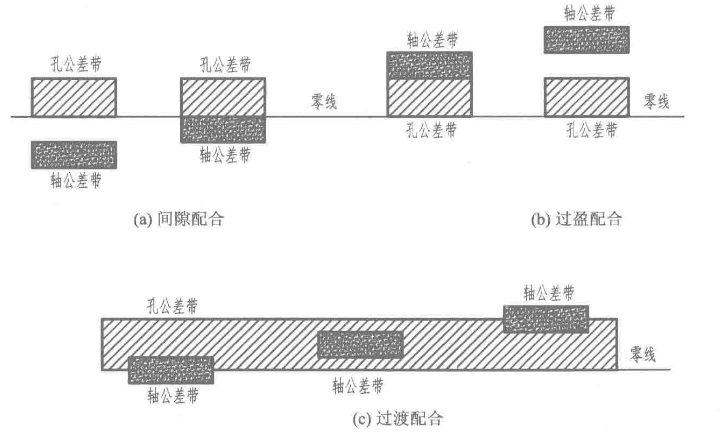
### 标准公差与基本偏差
孔、轴公差带由**标准公差**和**基本偏差**两个要素组成。标准公差确定公差带的大小，基本偏差确定公差带的位置。
#### 标准公差
标准公差的数值由**公称尺寸**和**公差等级**来确定。公差等级有20个等级，即IT01、IT0、IT1、...IT18。IT表示公差，数字表示公差等级，IT01公差值最小，精度最高；IT18公差值最大，精度最低。在20个标准公差等级中，IT01~IT12用于**配合尺寸**。

下表是部分标准公差数值。
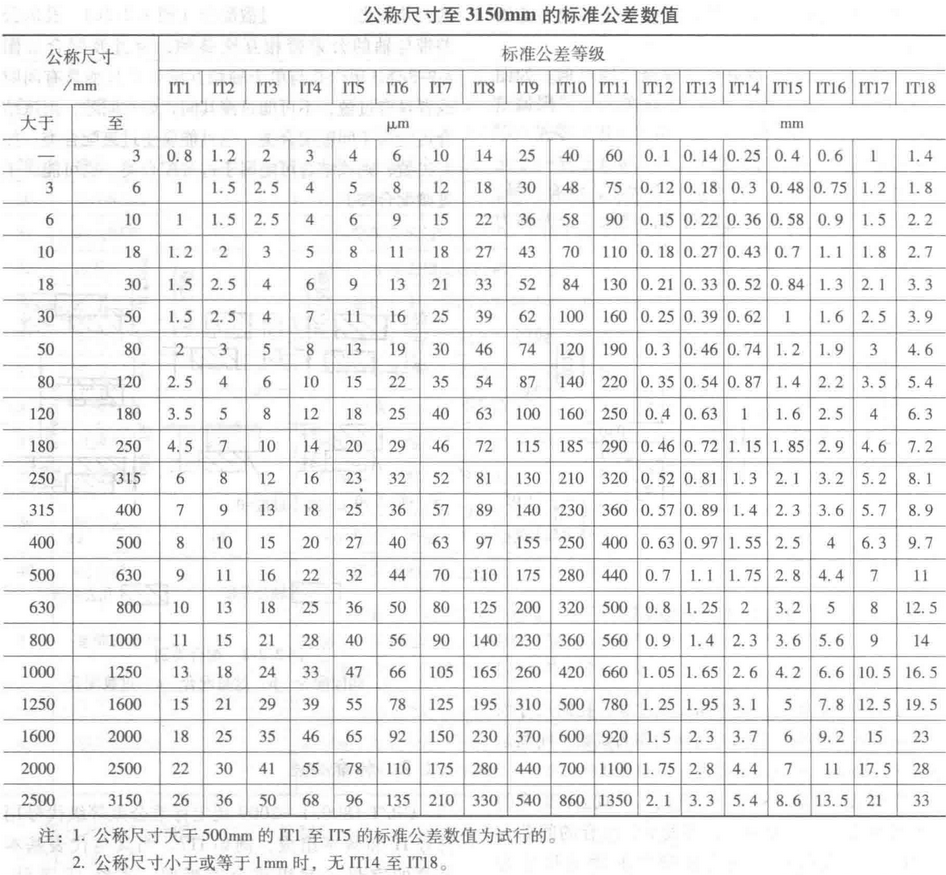
#### 基本偏差
基本偏差是极限与配合制中，确定公差带相对零线位置的上极限偏差或下极限偏差，一般是指孔和轴的公差带中靠近零线的那个偏差。
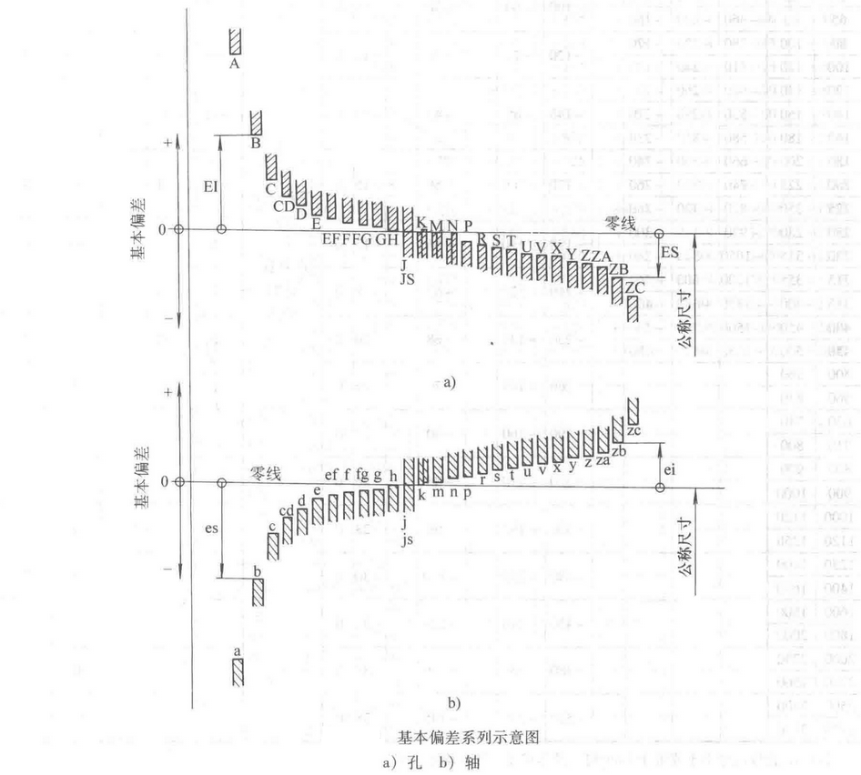
基本偏差系列示意图只表示公差带的位置，不表示公差带的大小，因此，公差带的一端是开口的，开口的另一端由标准公差限定。

如果基本偏差和标准公差等级确定了，那么孔和轴的公差带位置和大小就确定了，这时它们的配合类别也确定了。

轴和孔的公差带由基本偏差代号与公差等级数字表示。
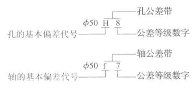
具体的上、下极限偏差数值可以查表获得。[GB/T 1800.2-2009](https://www.doc88.com/p-9913789256593.html)
### 配合制
同一极限制的孔和轴组成的一种配合制度，称为配合制。在制造互相配合的零件时，使其中一种零件作为基准件，它的基本偏差固定，通过改变另一种非基准件的偏差来获得各种不同性质的配合制度。有两种基准制：基孔制和基轴制。
#### 基孔制
**基本偏差为一定的孔的公差带**，与不同基本偏差的轴的公差带形成各种配合的一种制度。基孔制配合的孔称为基准孔，其基本偏差代号为H，下极限偏差为0，即它的下极限尺寸等于公称尺寸。
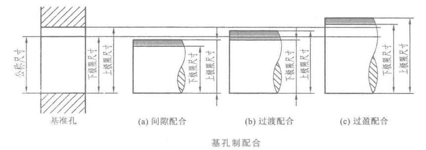
#### 基轴制
**基本偏差为一定的轴的公差带**，与不同基本偏差的孔的公差带形成各种配合的一种制度。基轴制配合的轴称为基准轴，其基本偏差代号为h，上极限偏差为0，即它的上极限尺寸等于公称尺寸。
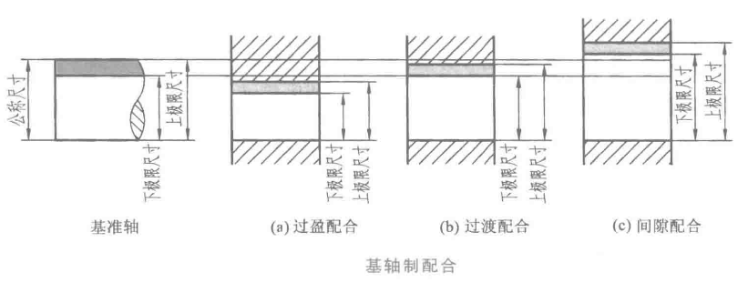
### 优先、常用配合
GB/T 1801-2009规定了公称尺寸至3150mm的孔、轴公差带的选择范围，并将允许选用的公称尺寸至500mm的孔、轴公差带分为“优先选用”、“其次选用”和“最后选用”三个层次，通常将优先选用和其次选用合称为常用。
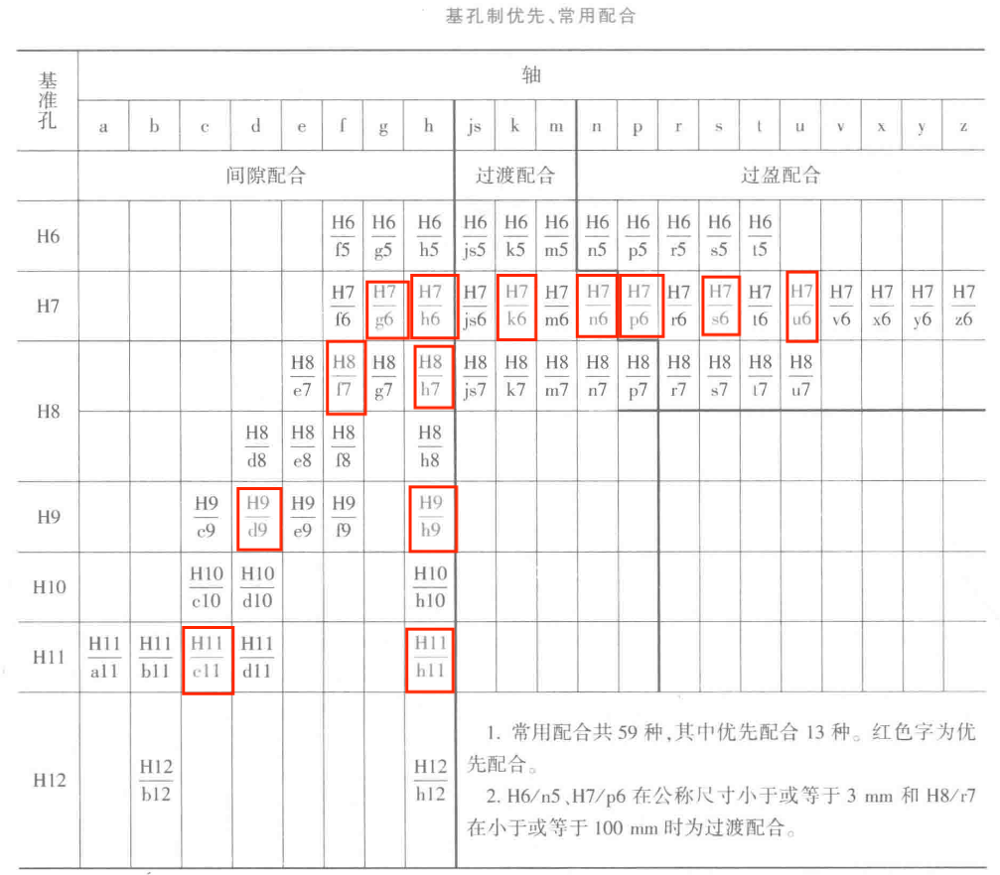
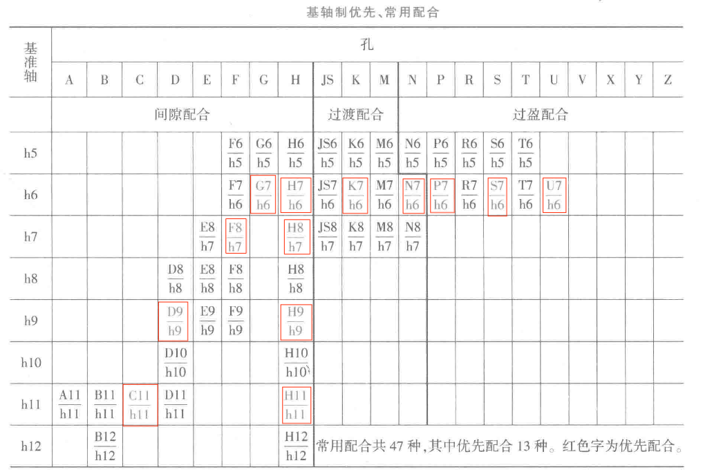
## 标注与查表
在装配图上标注配合代号，分别用一分式表示，分子为孔的公差带代号，分母为轴的公差带代号。通常分子中含有H的为基孔制配合，分母中含h的为基轴制配合。

标注方法
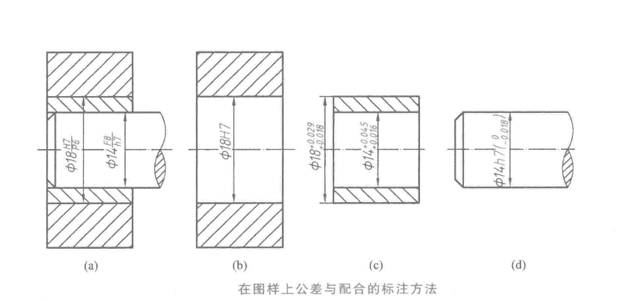
互相配合的孔和轴，按公称尺寸和公差带可通过查阅[GB/T 1800.2-2009](https://www.doc88.com/p-9913789256593.html)中所列的表格获得上、下极限偏差数值。

零件图上的任何尺寸都必须有明确的公差要求才能加工，对零件上较低精度的非配合尺寸也要控制误差、规定公差，这种公差称为一般公差，它们的公差等级和极限偏差值可查阅《一般公差  未注公差的线性和角度尺寸的公差》[GB/T 1804一2000](https://www.doc88.com/p-5754716700876.html)。
## FAQ
### 一般公差 未注公差
例：线性尺寸的极限偏差数值：
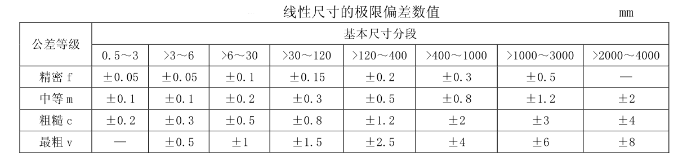
### 公差等级的选用标准
公差等级的选用应遵循功能优先、经济适度、工艺可行的原则。
**常用公差等级范围（ISO 286 / GB/T 1800 系列）**

| 公差等级         | 特点   | 加工方法或用途示例     |
| ------------ | ---- | ------------- |
| IT01、IT0、IT1 | 极高精度 | 精密计量仪器、量块     |
| IT2～IT4      | 高精度  | 精密轴承、量仪主件     |
| IT5～IT6      | 较高精度 | 精密配合、滑动轴承、齿轮轴 |
| IT7～IT8      | 中等精度 | 一般机械装配配合（最常用） |
| IT9～IT10     | 一般精度 | 普通机械零件        |
| IT11～IT13    | 粗精度  | 焊接件、冲压件、铸件等   |
| IT14～IT16    | 低精度  | 非配合尺寸、粗加工件    |
**选定公差等级**
- 一般选 IT6～IT8；
- 精密件 IT5～IT6；
- 普通结构 IT9～IT10；
- 粗糙件 IT11 以上。
#### 参考
<ul>
	<li><a href="https://www.sohu.com/a/753499177_121652032" target="_blank">公差等级划分</a></li>
	<li><a href="https://www.mechtool.cn/drawingandaccuracy/drawingandaccuracy_standardtolerancelevelforapplication.html" target="_blank">标准公差等级的应用</a></li>
</ul>
### 基孔制与基轴制的选择
一般应优先选用基孔制。设计时，为了减少定值刀具、量具的规格和种类，便于生产，提高经济性，应优先采用基孔制。孔的加工通常比轴更困难、成本更高。标准零件（如轴承、销、螺栓等）多按基孔制设计。

在可以获得明显的经济效益的情况下，选择基轴制。

**与标准件配合的基准制选择**
键（基孔制）、圆柱销（基轴制）及滚动轴承（外圈与孔基轴制，内圈与轴基孔制）均为标准件。
**对轴孔配合的使用要求**
一般为三种情况：装配后有相对运动要求的，应选用间隙配合；装配后需要靠过盈传递载荷的，应选用过盈配合；装配后有定位精度要求或需要拆卸的，应选用过渡配合或小间隙，小过盈的配合。
#### 参考
<ul>
	<li><a href="https://blob.wenxiaobai.com/article/182bfde2-634f-3319-db85-030a1b35fbb3" target="_blank">基孔制与基轴制的应用场景</a></li>
</ul>