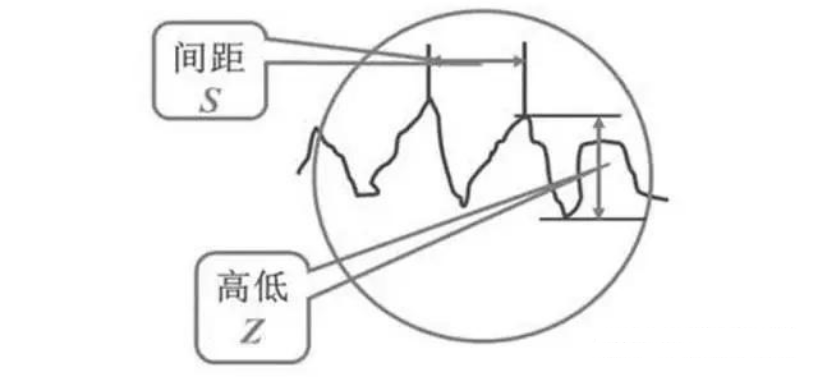
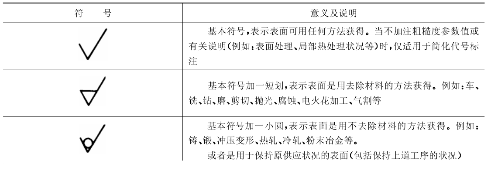
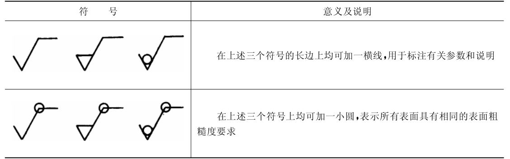
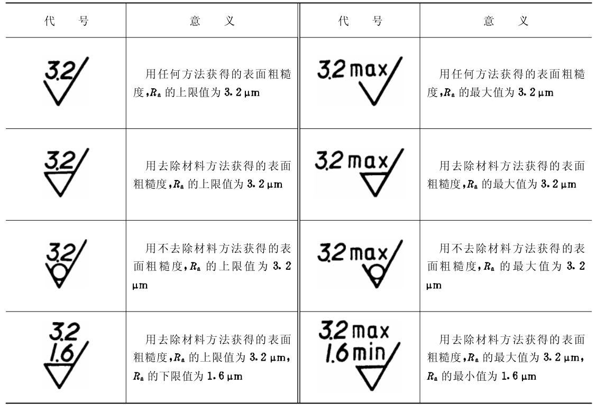

## 常见术语

### 扭矩

### 表面粗糙度

#### 基本概念

表面粗糙度是指加工表面具有较小间距和微小峰谷的不平度。其两波峰或两波谷之间的距离很小（在1mm以下），它属于微观几何形状误差。

国家标准规定常用三个指标来评定表面粗糙度（μm）：轮廓的平均算术偏差Ra、不平度平均高度Rz和大高度Ry。
在实际生产多用Ra指标。
#### 符号

**表面粗糙度高度参数轮廓算数平均偏差Ra值的标注如下表所示：Ra在代号中用数值表示，参数值前可不标注参数代号**

#### 参考
<ul>
	<li><a href="https://zhuanlan.zhihu.com/p/1961093242603930225" target="_blank">知乎-表面粗糙度</a></li>
	<li><a href="https://www.doc88.com/p-2065310036782.html?s=rel&id=1" target="_blank">表面粗糙度符号-代号及注法 GB/T 131-93</a></li>
</ul>