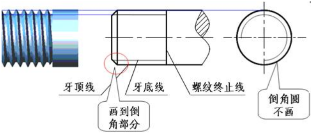
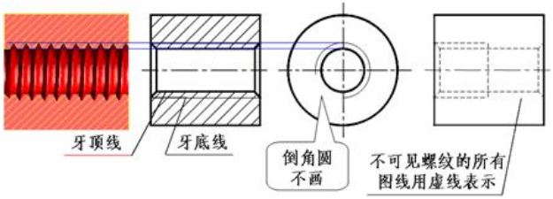
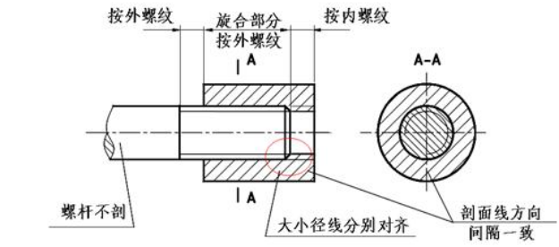
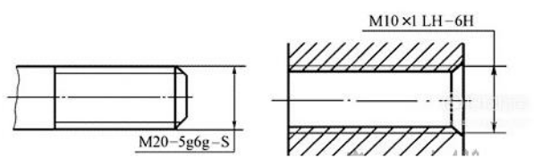

转载于：[江苏省机械工程学会-学术科普](http://jsmes.org/Home/Preview?id=830&channelId=11&orderbyid=1)
### 前言
螺纹是机械产品中常见的联接件，在绘制机械图纸时，螺纹的画法是有讲究的，国家机械制图标准中对螺纹画法做出了详细的规定。不同螺纹画法也不尽相同。
### 外螺纹
外螺纹不论其牙形如何，螺纹的牙顶(大径)及螺纹终止线用粗实线表示，螺杆的倒角或倒圆部分也应画出;牙底(小径)用细实线表示。

### 内螺纹
在剖视图中，小径用粗实线表示，大径用细实线表示;在投影为圆的视图上，表示大径圆用细实线只画约3/4圈，倒角圆省略不画，螺纹的终止线用粗实线表示，剖面线画到粗实线处。

### 螺纹相贯线的画法
螺孔与螺孔或螺孔与光孔相贯时，只画小径产生的相贯线。

### 普通螺纹
标准普通螺纹区分为粗牙和细牙，一般是单线螺纹，标记形式如下：

粗牙：M公称直径 旋向–公差带代号–旋合长度代号  

细牙：M公称直径×螺距 旋向–公差带代号–旋合长度代号  

M是普通螺纹的特征代号；大径和螺距是符合国家标准GB/T192-1981规定的系列值，粗牙不标注螺距，细牙必须标注螺距；旋向为右旋时省略，左旋时标注“LH”；公差带代号两组：第一组表示中径公差带代号，第二组表示顶径公差带代号，如果中径和顶径的公差带代号一样，则只注写一次，不重复书写；旋合长度是指两个相互旋合的螺纹，沿轴线方向相互结合的长度，对于普通螺纹，旋合长度代号有Short、Normal、Length，英文单词的第一个字母分别表示短、中、长三种旋合长度。一般情况下均采用中等旋合长度，故在标记中N不写出。必要时才注出S或L。标记形式中有框格的部分是可以省略的。
